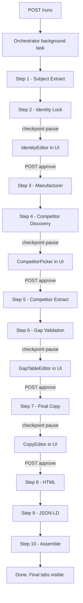

# JameCo PDP Workflow App

A FastAPI + React (Vite/TypeScript) workflow app that turns the JameCo PDP
content-strategist prompt into a 10-step pipeline. The pipeline auto-runs end
to end but pauses at four checkpoints so a human can review and edit before
continuing:

1. **Identity Lock** — confirm brand / MPN / SKU before any external search
2. **Competitor List** — pick which exact-match PDPs to extract
3. **Gap Validation** — toggle which gaps feed the final copy
4. **Final Copy** — edit the WYSIWYG copy before HTML + JSON-LD render

## Architecture

```
JameCo/
  backend/
    app/
      main.py                 FastAPI entrypoint
      config.py               Pydantic settings (.env)
      events.py               In-process pub/sub for SSE
      api/                    REST + SSE routes
      adapters/               OpenAI, Claude, SerpAPI, FireCrawl, BrowserBase
      models/                 SQLModel tables + Pydantic IO schemas
      workflow/
        orchestrator.py       Drives steps, persists progress, handles checkpoints
        registry.py           Step + checkpoint catalog
        state.py              In-memory RunState
        guardrails.py         Deny-list scrubber + excluded-content detector
        prompts/              System + per-step prompt templates
        steps/                step1_extract..step10_assemble
    tests/                    Pytest (guardrails + integration)
    pyproject.toml
    .env.example
  frontend/
    src/
      main.tsx                React root
      App.tsx                 Router shell
      api/client.ts           Typed fetch wrapper
      hooks/useRunStream.ts   SSE consumer
      pages/                  NewRun, RunHistory, RunDetail, StyleGuides
      components/             StepProgress + 4 checkpoint editors + tabs
      styles.css
```

### Tool routing

| Step | Tools |
| --- | --- |
| 1 Subject extract | FireCrawl (primary), Browserbase (fallback), LLM extraction |
| 2 Identity Lock | LLM extraction (structured) |
| 3 Manufacturer verification | SerpAPI discovery + FireCrawl/Browserbase fetch + LLM reasoning |
| 4 Competitor discovery | SerpAPI (4 query templates from the prompt) |
| 5 Competitor extraction | FireCrawl/Browserbase (parallel, max 4) + LLM extraction |
| 6 Gap validation | LLM reasoning, then code re-validates the 2-competitor / MFR-verified rule |
| 7 Final copy | LLM writing + deny-list scrubber + excluded-content detector |
| 8 HTML | Deterministic render from FinalCopy (no LLM) |
| 9 JSON-LD | Deterministic build from verified inputs (no LLM) |
| 10 Final output | Aggregate WYSIWYG + HTML + JSON-LD + sources + audit notes |

## Prerequisites

- Python 3.11+
- Node 20+
- API keys for at least: an LLM provider (OpenAI or Anthropic), SerpAPI,
  FireCrawl. Browserbase is optional but recommended as a fallback.

## Setup

### 1. Backend

```bash
python3 -m venv .venv
source .venv/bin/activate
pip install -e 'backend[dev]'
cp backend/.env.example backend/.env
# Edit backend/.env and set your keys
```

`.env` keys:

| Key | Required | Notes |
| --- | --- | --- |
| `OPENAI_API_KEY` | If you choose OpenAI for any step | |
| `ANTHROPIC_API_KEY` | If you choose Claude for any step (default) | |
| `SERPAPI_API_KEY` | Yes | Country defaults to US, language EN |
| `FIRECRAWL_API_KEY` | Yes | Primary scraper |
| `BROWSERBASE_API_KEY` / `BROWSERBASE_PROJECT_ID` | Optional | Fallback scraper |
| `LLM_REASONING_MODEL` | No | Default `claude-sonnet-4-6` |
| `LLM_WRITING_MODEL` | No | Default `claude-sonnet-4-6` |
| `LLM_EXTRACTION_MODEL` | No | Default `gpt-5` |
| `DATABASE_URL` | No | Default `sqlite:///./jameco.db` |

### 2. Frontend

```bash
cd frontend
npm install
```

## Run dev

In two terminals:

```bash
# Terminal 1 — backend
source .venv/bin/activate
cd backend
uvicorn app.main:app --reload --port 8000
```

```bash
# Terminal 2 — frontend
cd frontend
npm run dev
```

Open http://localhost:5173. The Vite dev server proxies `/api/*` to
`http://127.0.0.1:8000`.

## Tests

```bash
source .venv/bin/activate
cd backend
pytest -q
```

The guardrail tests cover:
- The deny-list redacts price / stock / lead-time / shipping / promo phrases
  but does not redact legitimate spec values (e.g. `12 V`).
- If an excluded gap row's content leaks into the LLM-generated final copy,
  the orchestrator detects it, strips it, and writes an audit note.

## How a run flows



Live progress is delivered to the UI via SSE on `GET /runs/{id}/events`.
Every step's input/output is persisted to SQLite, so you can refresh, close,
or reopen runs at any point without losing state.

## Style guides

Upload one or more PDP style guides via the **Style Guides** page (.md, .txt
or .pdf). Pick one when starting a new run; the text is included in the
system context for Step 7 (Final Copy).

## Provenance & safety

- Every spec / feature / FAQ carries a `sources` list with `kind` and `url`.
- Step 6's "Included" decision is re-validated in code: a row is only allowed
  in the final copy if it is **manufacturer-verified** OR appears on **2 or
  more distinct competitor domains**.
- Step 7 runs the deny-list scrubber and the excluded-content detector; both
  log to `audit_notes` so the user is warned if the model misbehaved.
- Step 9 builds JSON-LD deterministically from typed inputs — no fabricated
  ratings, prices, availability, or images.

## Out of scope (v1)

- Auth / multi-user
- Cron / scheduled runs
- Cost dashboards beyond per-run token counts
- Production deployment config (Docker can be added later)
